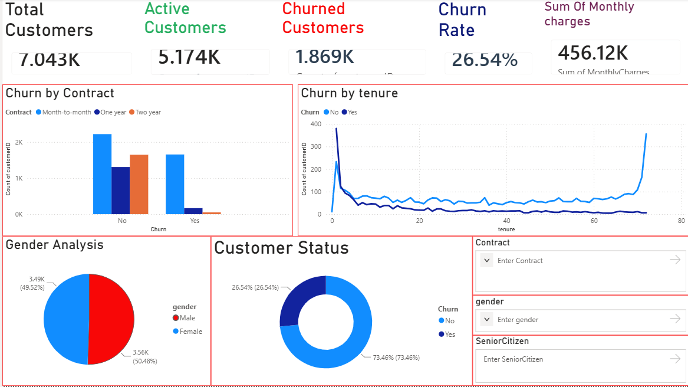
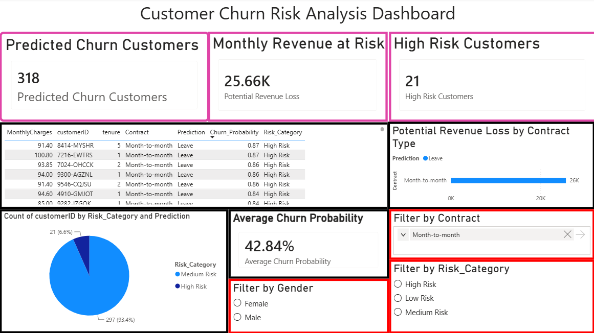

# Customer Churn Prediction & Risk Analysis Dashboard

## Project Overview

This project focuses on predicting customer churn using Machine Learning and visualizing business insights through an interactive Power BI dashboard.

The goal is to identify customers who are likely to leave the company, estimate potential revenue loss, categorize customers based on risk levels, and support customer retention strategies.

---

## Business Problem

Customer churn is one of the biggest challenges for telecom companies. When customers stop using services, businesses lose recurring revenue and incur higher costs to acquire new customers.

This project helps answer the following business questions:

- Which customers are likely to churn?
- Which customers are at the highest risk?
- How much revenue is potentially at risk?
- Which contract types contribute most to churn?

---

## Tools & Technologies Used

- Python
- Pandas
- NumPy
- Scikit-Learn
- Logistic Regression
- Power BI
- Matplotlib
- Seaborn

---

## Project Workflow

1. Data Collection
2. Data Cleaning
3. Data Preprocessing
4. Exploratory Data Analysis (EDA)
5. Feature Engineering
6. Machine Learning Model Training
7. Churn Prediction
8. Churn Probability Calculation
9. Risk Categorization
10. Power BI Dashboard Development
11. Business Insights Generation

---

## Project Architecture

```text
Telecom Customer Dataset
            ↓
      Data Cleaning
            ↓
    Data Preprocessing
            ↓
   Feature Engineering
            ↓
 Logistic Regression Model
            ↓
     Churn Prediction
            ↓
   Churn Probability Score
            ↓
      Risk Categories
            ↓
     Power BI Dashboard
            ↓
      Business Insights
```

---

## Machine Learning Model

### Model Used

- Logistic Regression

### Evaluation Metrics

- Accuracy Score
- Confusion Matrix
- Classification Report

### Additional Features

- Churn Probability Calculation
- Customer Risk Categorization
- Revenue Impact Analysis

---

## Customer Risk Categories

Customers are segmented into risk groups based on churn probability:

| Churn Probability | Risk Category |
|------------------|--------------|
| ≥ 80% | High Risk |
| 50% - 79% | Medium Risk |
| < 50% | Low Risk |

This helps businesses prioritize retention efforts toward customers most likely to churn.

---

## Dashboard Features

### Page 1: Customer Churn Overview

- Total Customers KPI
- Total Revenue KPI
- Churn Rate KPI
- Churn by Contract Type
- Churn by Customer Tenure
- Interactive Filters

### Page 2: Customer Risk Analysis

- Predicted Churn Customers KPI
- Potential Revenue Loss KPI
- High Risk Customers KPI
- Average Churn Probability KPI
- Risk Category Distribution
- Revenue Loss by Contract Type
- High Risk Customer Table
- Interactive Slicers
- Custom Tooltips

---

## Key Business Insights

- Customers on Month-to-Month contracts show the highest churn risk.
- Churn probability helps identify customers requiring immediate retention efforts.
- Revenue impact analysis highlights the financial risk associated with customer attrition.
- High-risk customers can be targeted with personalized offers and retention campaigns.
- Risk categorization simplifies decision-making for business stakeholders.

---

## Dashboard Screenshots

### Customer Churn Overview

Add screenshot here: 



### Customer Risk Analysis

Add screenshot here:



---

## Project Structure

```text
Customer-Churn-Prediction-Dashboard
│
├── data
│   └── Churn.csv
│
├── outputs
│   └── predictions_clean.csv
│
├── dashboard
│   └── Customer_Churn.pbix
│
├── screenshots
│   ├── dashboard_page1.png
│   └── dashboard_page2.png
│
├── churn_analysis.py
│
├── requirements.txt
│
└── README.md
```

---

## How to Run the Project

### Clone Repository

```bash
git clone https://github.com/your-username/Customer-Churn-Prediction-Dashboard.git
```

### Install Dependencies

```bash
pip install -r requirements.txt
```

### Run Python Script

```bash
python churn_analysis.py
```

### Open Power BI Dashboard

```text
dashboard/Customer_Churn.pbix
```

---

## Future Improvements

- Deploy model using Streamlit
- Add advanced machine learning algorithms
- Integrate real-time customer data
- Implement automated churn alerts
- Build customer retention recommendation system

---

## Author

**Aryan Jangra**

B.Tech Computer Science Engineering

Aspiring Data Analyst | Business Analyst | Power BI Developer

---
### Connect With Me

📧 Email: aryanjangra0508@gmail.com

🔗 LinkedIn: https://www.linkedin.com/in/aryan0508/

💻 GitHub: https://github.com/Aryan5820

---


## License

This project is created for educational and portfolio purposes.